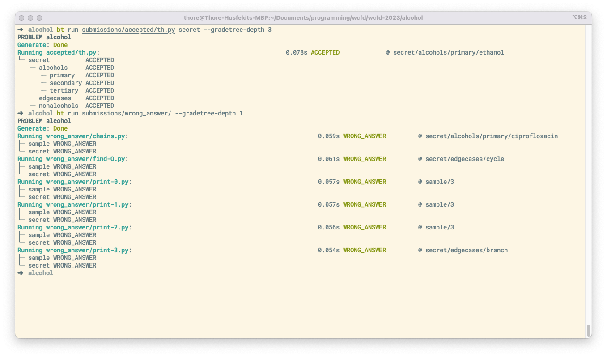
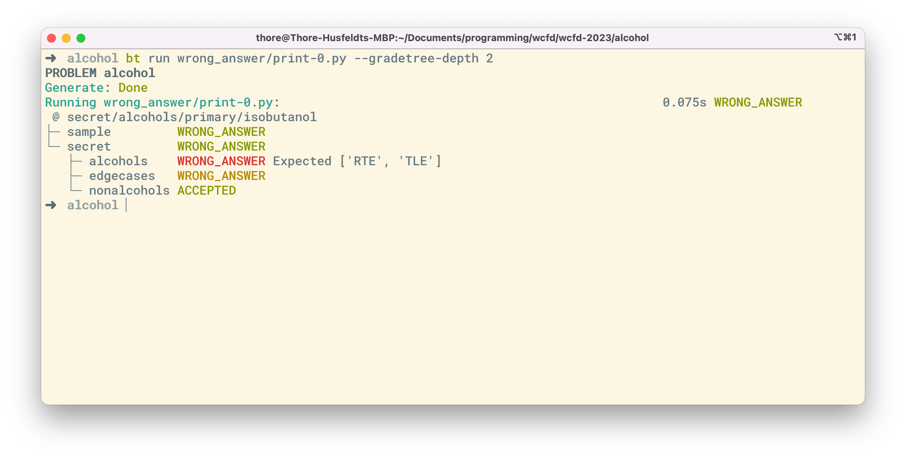
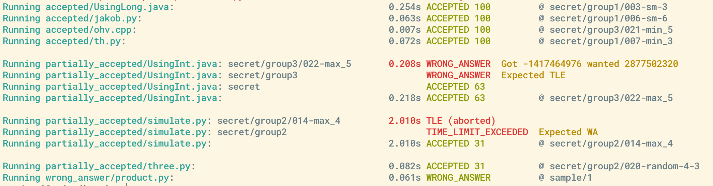

# BAPCtools Fork

This is a fork of [RagnarGrootKoerkamp/BAPCtools](https://github.com/RagnarGrootKoerkamp/BAPCtools) focussing on test groups and grading.

## Use Default Grader

`bt run` now runs the default grader described in [the specification](https://icpc.io/problem-package-format/spec/problem_package_format#default-grader-specification) and implemented in [Kattis/problemtools](https://github.com/Kattis/problemtools/tree/develop/support/default_grader).

In particular, it builds a tree (the *testdata tree*) defined by the directory structure of `data/` and aggregates the grades of all given testcases, resulting in a tree of grades.
If the verdict at the root disagrees with the verdict determined by `bt run`, it issues a warning.

The verdicts for the subtrees can be shown using `--gradetree_depth <depth>`, the default is depth 0 (so nothing about grading is normally printed and `run` behaves exactly as usual.)



## Fine-grained Specification of Expected Grades

A YAML file `<problemdir>/submissions/expected_grades.yaml` allows specification of expected behaviour per submisions.
In its simplest form, the file just lists submission names with expected verdicts and adds no new information to the already-existing hierarchy of `submission` subdirectories:
```yaml
accepted/th.py: AC
accepted/th-golf.py: AC
wrong_answer/connected-graphs.py: WA
time_limit_exceeded/recursive.py: TLE
```

Instead of verdict *strings*, the format also allows *lists* of verdicts using normal YAML conventions.
This allows us to specify that the recursive Python submission may `TLE` or `RTE` (typically depending the compiler), but not `WA`. This convention is strictly more general than what `submission` subdirectories can allow.
```yaml
time_limit_exceeded/recursive.py: ['TLE', 'RTE']
```
or
```yaml
time_limit_exceeded/recursive.py:
- TLE
- RTE
```

Moreover, the expected grades can be specified for subtrees of the tree of testcases defined by the `data` directory.
A simple example is
```
wrong_answer/connected-graphs.py:
  sample: AC
  secret: WA
```
which specifies that the `WA` submission `connected_graphs.py` must accept the testcases in `sample`.

If you have more subgroups in `data/secret`, you can specify the expected verdicts at any level. Here’s an example for a submission for an IOI-style problem with three testgroups, where a greedy submission solves the first two:
```
partially-accepted/greedy.py:
  subgroups:
    sample: AC
    secret:
      group1: AC
      group2: AC
      group3: WA
```

But the syntax is agnostic towards how you organise your test groups. Here is another example: the `connected.py`-submission is supposed to work on all instances where the graph is connected.
```
wrong_answer/connected.py:
  verdict: WA
    sample: AC
    secret:
      connected: AC
```

`bt run` is aware of the expectations and decorates its sub-testgroup output accordingly:



When `bt run` evaluates a testcase that leads to an unexpected grade (either for the testcase itself or for an ancestor of the testcase, such as `sample` or `secret/edge_cases/disconnected_graphs` or `secret/group1`), it reports the inferred verdicts and highlights unexpected grades.



